# Họ Và Tên: Lý Văn Thủy - MSV: 23810310226
# Thực hành 19/03/2026 (N2): Restaurant App - P2
## Mô tả
Ứng dụng Restaurant App thực hành Navigation với React Native, Expo và Context API, gồm đăng nhập, đăng ký, tìm kiếm sản phẩm từ `data.js`, lọc theo danh mục và màn hình Order/Profile.

## Screenshots

### Đăng ký

### Đăng nhập

### Home View All
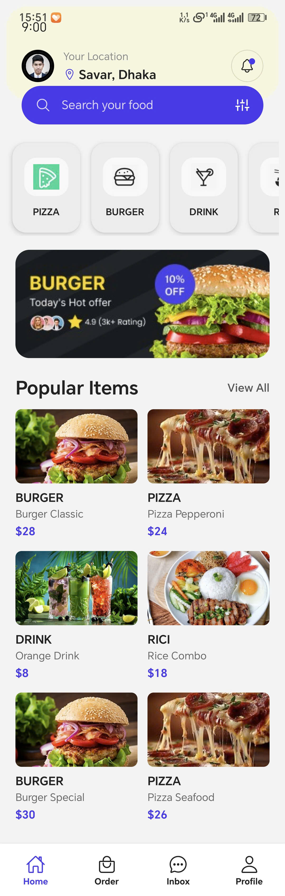

### Icon Burger
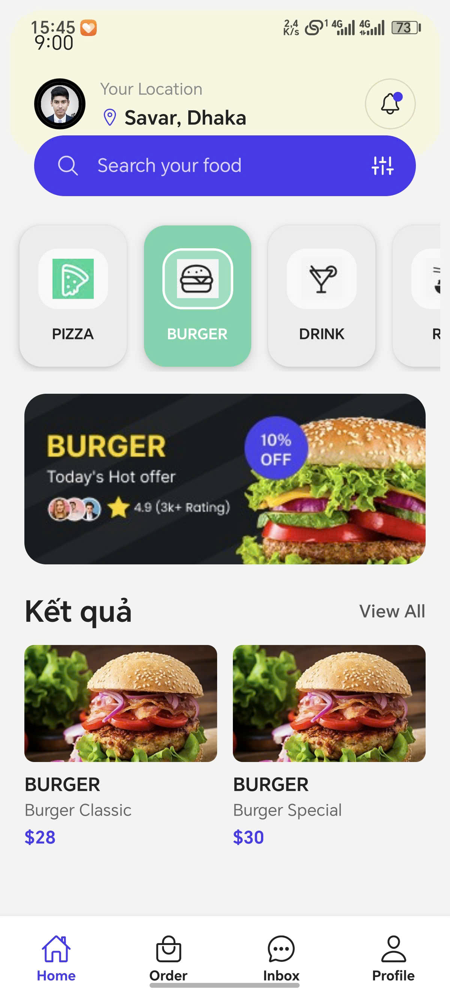

### Icon Drink
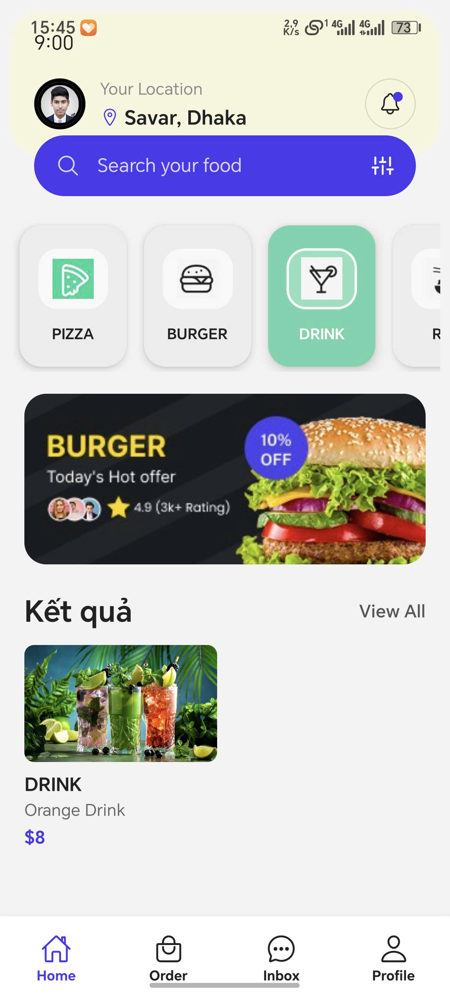

### Icon Pizza
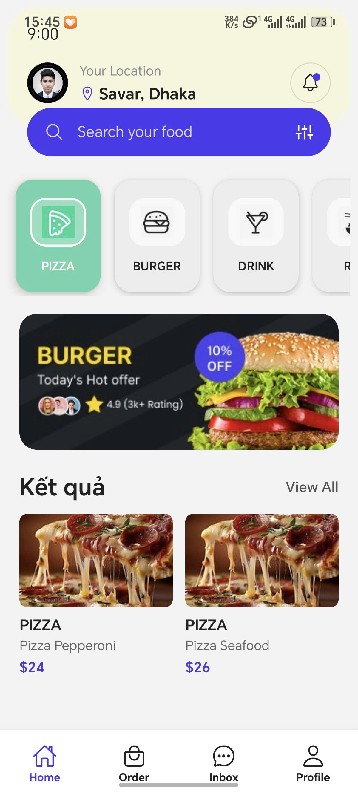

### Icon Rice
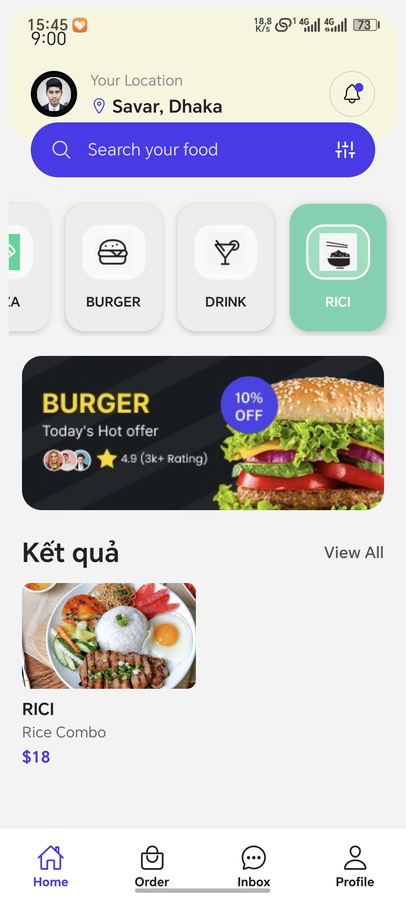

### Order x10
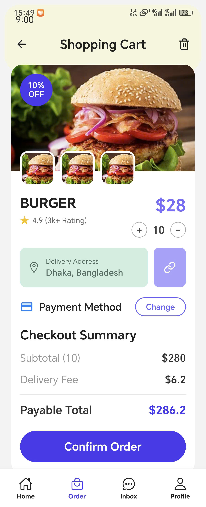

### Order

### Profile
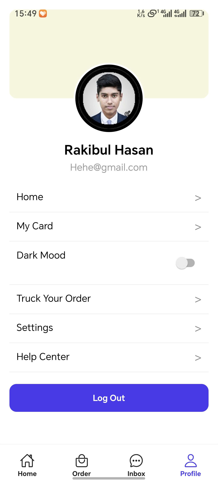

### Search Burger
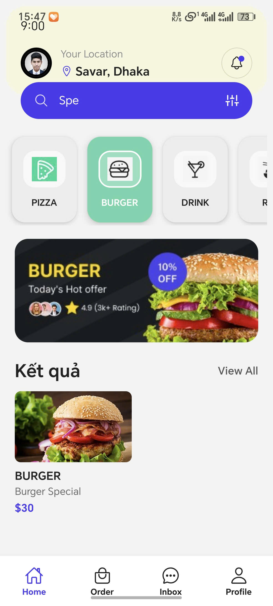

### Search Drink
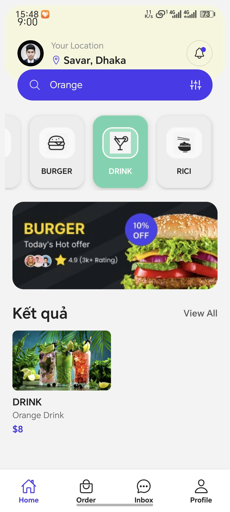

### Search Pizza
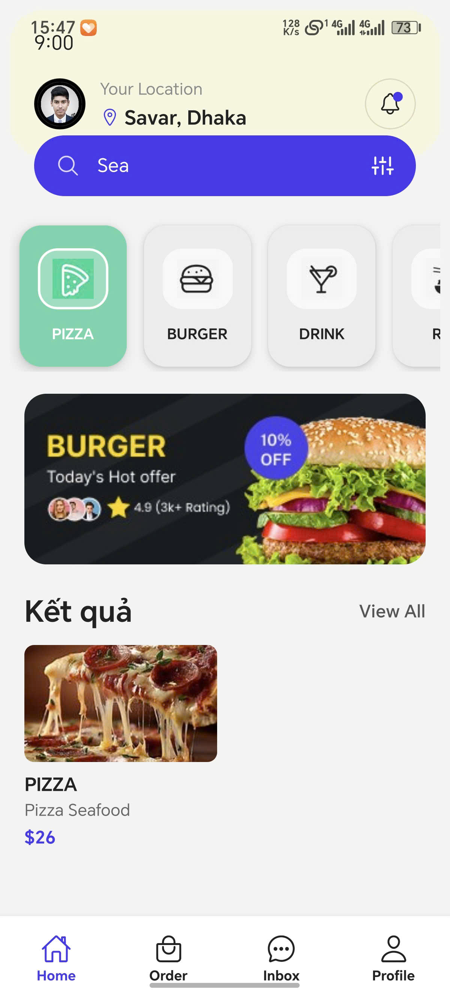

### Search Rice
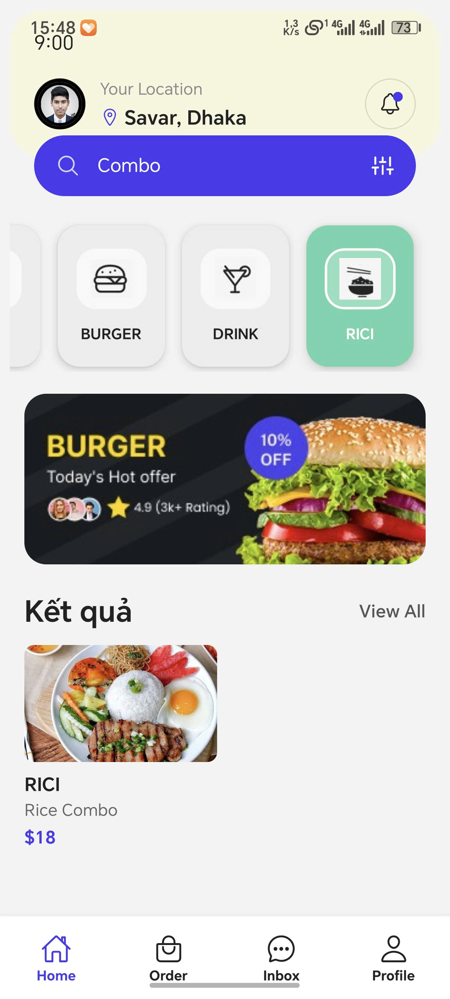
